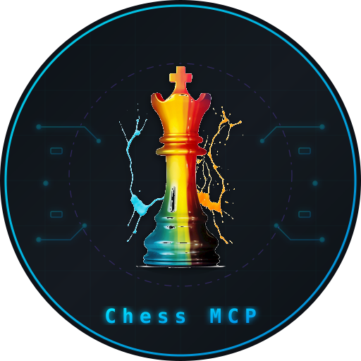

# Chess MCP Server

**A Model Context Protocol (MCP) server for Chess.com — enabling AI assistants to explore player profiles, ratings, game archives, leaderboards, clubs, and puzzles.**

---

## What is this?

This MCP server wraps the [Chess.com Published Data API](https://www.chess.com/news/view/published-data-api) — a free, no-auth API with data on 100M+ players. Use it with AI assistants like GitHub Copilot or Claude to:

- Analyze Magnus Carlsen's blitz rating
- Review Hikaru's latest bullet games
- Compare any two players side by side
- Get daily puzzles
- Explore leaderboards, clubs, and tournaments

## Packages

| Package | Description | Docs |
|---------|-------------|------|
| [`@fazorboy/chess-mcp-server`](packages/chess-server) | Core MCP server (npm) — use with Claude, VS Code, or any MCP client | [Server README](packages/chess-server/README.md) |
| [`chess-mcp-vscode`](packages/chess-vscode-extension) | VS Code extension — one-click install, zero config | [Extension README](packages/chess-vscode-extension/README.md) |

## Available Tools (12)

| Tool | Description |
|------|-------------|
| `gm_player_profile` | Get player profile (name, title, country, followers) |
| `gm_player_stats` | Get ratings across all game types |
| `gm_player_games` | Get recent games with results and accuracy |
| `gm_game_details` | Get details for a specific game by URL |
| `gm_game_archives` | List all available monthly archives |
| `gm_leaderboards` | Global leaderboards by category |
| `gm_titled_players` | List all GMs, IMs, FMs, etc. |
| `gm_club_info` | Club information and stats |
| `gm_club_members` | List club members by activity |
| `gm_player_tournaments` | Tournament history and results |
| `gm_compare_players` | Side-by-side player comparison |
| `gm_random_puzzle` | Daily chess puzzle with FEN/PGN |

## Configuration

Settings can be configured via VS Code settings or environment variables:

| Setting | Env Variable | Default | Description |
|---------|-------------|---------|-------------|
| `chessMcp.baseUrl` | `CHESS_BASE_URL` | `https://api.chess.com` | API base URL |
| `chessMcp.maxGames` | `CHESS_MAX_GAMES` | `50` | Max games per query |
| `chessMcp.timeoutMs` | `CHESS_TIMEOUT_MS` | `15000` | Request timeout (ms) |
| `chessMcp.userAgent` | `CHESS_USER_AGENT` | `Chess-MCP/0.1.0` | User-Agent header |

## License

[MIT](LICENSE)
